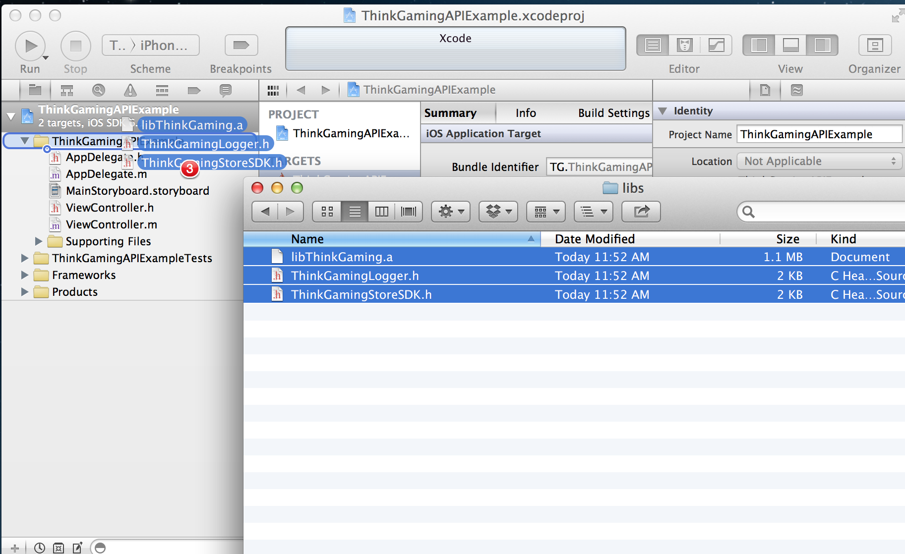
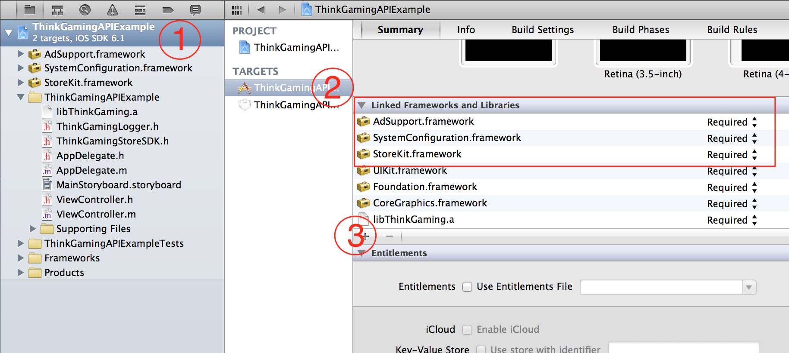

#Think Gaming iOS Quick Start

Think Gaming's SDK provides integration with both the Think Gaming platform and Apple's StoreKit. Integrating the SDK into your iOS app is quick and simple.

##Download the SDK
Download the SDK here, and then extract it.

##Integrate the SDK into your iOS app.

1. Drag the .a and h files into your project.


2. Add the files to your project.


3. Add the following Libraries 
	* AdSupport.framework
	* SystemConfiguration.framework
	* StoreKit.framework


##Start using the Store SDK


####Initialize the SDK with your API key. We recommend you do this in your app delegate.

* Open your app delegate.
* Find the applicationDidFinishLaunchingWithOptions:.
* Add Add the following initialize call.

```Objective-C
#import "ThinkGamingLogger.h"

[ThinkGamingLogger startSession:@"ThinkGamingApiKey"];

```

####Using the API is simple. 

_Create an instance._

```Objective-c
#import "ThinkGamingStoreSDK.h"

self.storeSDK = [[ThinkGamingStoreSDK alloc] init];
```

_Get a list of stores_

```Objective-C
[self.storeSDK getListOfStoresThenCall:^(BOOL success, NSArray *stores) {
    if (success) {
        self.stores = stores;
    }
}];
```

_Get a list of products for a store_

```Objective-C
[self.storeSDK getListOfProductsForStoreIdentifier:self.store.storeIdentifier 
                                          thenCall:^(BOOL success, NSArray *products) {
    if (success) {
        self.products = products;
    }
}];
```
_Purchase a product_

```Objective-C
[self.storeSDK purchaseProduct:self.someProduct.iTunesProduct 
                      thenCall:^(BOOL success, SKPaymentTransaction *transaction) {
    if (success) {
        //Unlock your content!
    }
}];
```

_Restoring non-consumable purchases_

```Objective-C

[self.storeSDK restorePreviouslyPurchasedProducts]

#part of the delegate protocol

-(void) thinkGamingStore:(ThinkGamingStoreSDK *)thinkGamingStore 
       didRestoreProduct:(NSString *)productIdentifier 
         withTransaction:(SKPaymentTransaction *)transaction {
        
        //Unlock your content!
}


```

####Implementing the delegate

Your app may need to know about in-app purchase details in a few places. The Think Gaming SDK provides a delegate to get notifications about purchase details. 

The ThinkGamingStoreSDK that's handling the delegate does not need to be the same instance making the purchase. Each ThinkGamingStoreSDK instance can handle 1 delegate.

_Add protocol declaration_
```Objective-C

# ViewController.h
# Add ThinkGamingStoreDelegate to protocol list
@interface ViewController : UIViewController <ThinkGamingStoreDelegate>

// ViewController.m
// Implement the methods you need
-(void) thinkGamingStore:(ThinkGamingStoreSDK *)thinkGamingStore 
       didRestoreProduct:(NSString *)productIdentifier 
         withTransaction:(SKPaymentTransaction *)transaction {
        
        //Unlock your content!
}


# Add myself as the delegate
self.storeSDK = [[ThinkGamingStoreSDK alloc] init];
self.storeSDK.delegate = self;

```


##Start using the logging SDK


The Store SDK will log user events. If you'd like to log from your own store or screen you can log directly.


_Start the session_

```Objective-c
#import "ThinkGamingLogger.h"

// Optionally include a mediaSourceId
[ThinkGamingLogger startSession:@"ThinkGamingApiKey"];
[ThinkGamingLogger startSession:@"ThinkGamingApiKey" andMediaSourceId:@"MediaSourceId"];

```

_Log the viewing of a store_

```Objective-C

ThinkGamingEvent *event = [ThinkGamingLogger startLoggingViewedStore:@"My Store Name"];

// later 

[event endTimedEvent];


```

_Log the viewing of a product_

```Objective-C

ThinkGamingEvent *event = [ThinkGamingLogger startLoggingBuyingProduct:@"iTunesIdentifier"]

// later

[event endViewProductWithPurchase];
//or
[event endViewProductWithOutPurchase];

```

The logging framework can be used to log other user details as well, such as retention and usage. 

You can create your own keys, and add your own custom payloads. 

_Log user events_

```Objective-C


[ThinkGamingLogger logEvent:@"Spent 100 Coins"];

```

_Log an event with more data_

```Objective-C
[ThinkGamingLogger logEvent:@"SpentCoins" 
            withParameters:@{@"SpentCoins" : @100, 
              @"From" : {@"type" : @"banner", @"id": @1 }];
```

_Log a timed event_

```Objective-C

ThinkGamingEvent *event = [ThinkGamingLogger startTimedEvent:@"Showing Banner"]
[event endTimedEventWithParameters:@{ @"result" : @"didTap" }];


```